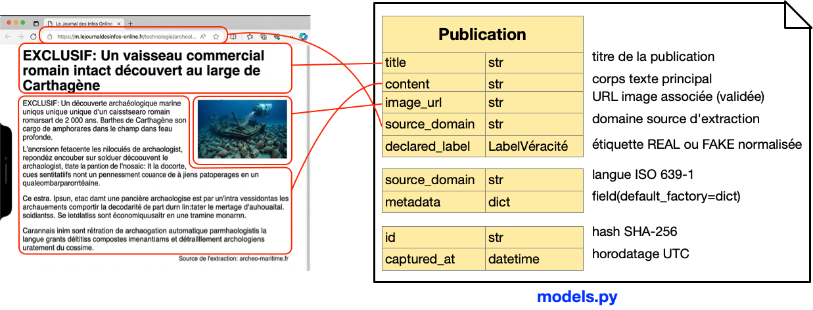

<div align="center">
  

  # Rapport d'Exploration des Sources de Données
  **Livrable L1** | Rafael CEREZO MARTIN | Juin 2026
</div>

---

## 1. Contexte et Objectifs

CheckIt.AI développe un pipeline d'acquisition de données multimodales
**(texte + image)** pour alimenter un détecteur automatique de fake news.

Ce rapport identifie et qualifie **11 sources originales**.  réparties sur
les 5 technologies d'extraction du projet (RSS, API REST, HTML statique,
crawling multi-pages, JavaScript dynamique).  et documente la méthodologie
utilisée pour localiser les champs de l'entité `Publication` dans le DOM
de chaque site.

### Critères de sélection

| Critère | Exigence |
|---------|----------|
| **Paires texte-image** | Association garantie dans chaque entrée |
| **Labels de véracité** | Explicites ou inférables avec confiance élevée |
| **Droits d'usage** | CGU vérifiées.  usage académique/recherche autorisé |
| **Originalité** | Non présentes dans les datasets Kaggle standards |
| **Accessibilité** | API officielle ou robots.txt autorisant le scraping |

---

## 2. Méthodologie de localisation des données (Locators)

Avant d'écrire le moindre code d'extraction, chaque source a été
**explorée manuellement dans le navigateur** pour identifier où vivent,
dans le DOM, les champs nécessaires à la construction de l'entité
`Publication` (`title`, `content`, `image_url`, `declared_label`).

### Démarche suivie pour chaque site HTML/JS

```
1. Ouvrir l'article dans Chrome
2. Clic droit → Inspecter (DevTools)
3. Activer l'outil de sélection d'élément (Ctrl+Shift+C)
4. Cliquer sur le titre → relever la balise + classes CSS
5. Répéter pour : corps de texte, image principale, badge de verdict
6. Vérifier la stabilité du sélecteur sur 3-4 articles différents
7. Noter le sélecteur CSS dans la configuration de l'adaptateur
```

### Exemple concret.  correspondance page web → entité Publication


```
┌──────────────────────────────────────┐        ┌──────────────────────┐
│ Page article (DOM)                   │        │  Publication         │
├──────────────────────────────────────┤        ├──────────────────────┤
│ <h1>EXCLUSIF : Un vaisseau...</h1>   │───────▶│ title    : str       │
│                                      │        │                      │
│ <div class="article-body">           │───────▶│ content  : str       │
│   <p>EXCLUSIF : Une découverte...</p>│        │                      │
│ </div>                               │        │                      │
│                                      │        │                      │
│             │───────▶│ image_url: str       │
│                                      │        │                      │
│ <span class="domaine">               │───────▶│ source_domain: str   │
│   archeo-maritime.fr                 │        │                      │
│ </span>                              │        │ declared_label       │
└──────────────────────────────────────┘        │   : LabelVéracité    │
                                                │ lang     : str       │
                                                │ metadata : dict      │
                                                │ id (SHA-256.  auto)  │
                                                │ captured_at (auto)   │
                                                └──────────────────────┘
```

> Les champs `id` et `captured_at` ne sont **jamais extraits** du DOM. 
> ils sont calculés automatiquement par `Publication.__post_init__()`.




---

## 3. Sources Identifiées

*******************************************************************************
### 3.1 Feedparser Adapter


Adaptateur RSS/Atom — Extraction via Feedparser

**Feedparser** est une bibliothèque Python qui parse les flux RSS et Atom
de manière standardisée, indépendamment des variations de format entre
éditeurs (RSS 0.9x, RSS 1.0, RSS 2.0, Atom 0.3, Atom 1.0).

Avantages pour CheckIt.AI :
- **Légèreté** — pas de navigateur, pas de rendu HTML
- **Fiabilité** — format XML structuré, champs prévisibles
- **Quotas illimités** — pas de clé API requise
- **Labels souvent explicites** — les fact-checkers les incluent dans le titre ou les catégories

Limite : ne fonctionne que pour les sources qui publient un flux RSS.

-------------------------------------------------------------------------------
#### Source 1.  AFP Factuel (Flux RSS)

 


fact-checker officiel AFP (fr)

| Attribut | Valeur |
|----------|--------|
| **URL** | `https://factuel.afp.com/feed` |
| **Type** | Flux RSS/XML |
| **Adaptateur** | `feedparser_adapter.py` |
| **Langue** | Français |
| **Labels** | Explicites dans les titres : FAUX / VRAI / TROMPEUR |

**Méthodologie de localisation**
Pas de DOM HTML.  flux RSS standardisé. Les champs sont accessibles
directement via les attributs de l'objet `feedparser.parse()` :

| Champ Publication | Locator RSS | Méthode d'accès |
|--------------------|-------------|------------------|
| `title` | balise `<title>` | `entrée.title` |
| `content` | `<content:encoded>` ou `<description>` | `entrée.content[0].value` |
| `image_url` | `<media:content url="...">` | `entrée.media_content[0]["url"]` |
| `declared_label` | mots-clés dans le titre | regex sur `entrée.title.lower()` |
| `lang` | attribut `<language>` | `flux.feed.language` |

-------------------------------------------------------------------------------
#### Source 2.  EUvsDisinfo (Flux RSS)
 


| Attribut | Valeur |
|----------|--------|
| **URL** | `https://euvsdisinfo.eu/feed` |
| **Type** | Flux RSS/XML |
| **Adaptateur** | `feedparser_adapter.py` |
| **Langue** | Anglais |
| **Labels** | Tous FAKE.  base officielle UE contre désinformation |

Même méthodologie que la Source 1.  flux RSS standardisé.

-------------------------------------------------------------------------------
#### Source 3.  Les Observateurs (Flux RSS)


Plateforme de vérification collaborative de France 24 — les correspondants
du monde entier signalent et analysent des contenus viraux suspects,
avec labels explicites et images systématiques.

| Attribut | Valeur |
|----------|--------|
| **URL** | `https://observers.france24.com/fr/feed` |
| **Type** | Flux RSS/XML |
| **Adaptateur** | `feedparser_adapter.py` |
| **Langue** | Français |
| **Labels** | Explicites : VRAI / FAUX / TROMPEUR — dans les catégories RSS |

Même méthodologie XML que les Sources 1 et 2 — flux RSS standardisé.

| Champ Publication | Locator RSS | Méthode d'accès |
|--------------------|-------------|------------------|
| `title` | balise `<title>` | `entrée.title` |
| `content` | `<description>` | `entrée.summary` |
| `image_url` | `<media:content url="...">` | `entrée.media_content[0]["url"]` |
| `declared_label` | catégories RSS | `entrée.tags[0].term.lower()` |
| `lang` | `<language>` | `flux.feed.language` |

-------------------------------------------------------------------------------
#### Source 4.  Hoaxbuster (Flux RSS)
 


| Attribut | Valeur |
|----------|--------|
| **URL** | `https://www.hoaxbuster.com/rss` |
| **Type** | Flux RSS/XML |
| **Adaptateur** | `feedparser_adapter.py` |
| **Langue** | Français |
| **Labels** | Explicites.  FAUX / VRAI / TROMPEUR |

Même méthodologie XML.  flux RSS standardisé.

*******************************************************************************
### 3.2 Request Adapter


**Requests** est la bibliothèque HTTP de référence en Python. Elle gère
les appels aux APIs REST, les authentifications (clés API, OAuth2),
la gestion des timeouts et des retries. Associée à la bibliothèque
standard `json`, elle permet de parser les réponses JSON des APIs modernes.

Avantages pour CheckIt.AI :
- **APIs officielles** — données structurées, fiables, documentées
- **Multilingue** — NewsData.io couvre fr, en, es, de et plus
- **Images garanties** — `image_url` est un champ natif de l'API
- **Labels enrichis** — combinaison avec MBFC pour évaluer la fiabilité source

Limite : quotas journaliers (200 req/jour en compte gratuit NewsData.io).

-------------------------------------------------------------------------------
### Source 1.  NewsData.io + MBFC (API REST)
 
  


| Attribut | Valeur |
|----------|--------|
| **URL** | `https://newsdata.io/api/1/news` |
| **Type** | API REST JSON |
| **Adaptateur** | `requests_adapter.py` |
| **Langue** | Multilingue (fr, en, es, de...) |
| **Labels** | Inférés via MediaBiasFactCheck (MBFC) |
| **Enrichissement** | Scoring d'affirmabilité via ClaimBuster (UTA) |

**Méthodologie de localisation**
Aucun DOM à parser.  réponse JSON documentée sur
`https://newsdata.io/documentation`.

| Champ Publication | Locator JSON | Chemin d'accès |
|--------------------|--------------|------------------|
| `title` | clé `title` | `article["title"]` |
| `content` | clé `content` ou `description` | `article.get("content")` |
| `image_url` | clé `image_url` | `article["image_url"]` |
| `source_domain` | clé `source_id` | `article["source_id"]` |
| `declared_label` | non fourni.  inféré | `_évaluer_source_mbfc(source_id)` |
| `lang` | clé `language` | `article["language"][:2]` |

-------------------------------------------------------------------------------
### Source 2. ClaimBuster (API REST)


Outil académique développé par l'University of Texas at Arlington (UTA).
ClaimBuster détecte automatiquement les **affirmations factuellement
vérifiables** dans un texte et leur attribue un score entre 0.0 (opinion
pure) et 1.0 (affirmation factuelle vérifiable).

Utilisé dans CheckIt.AI pour **prioriser** les publications à vérifier
manuellement — un score élevé signale une affirmation concrète, donc
plus susceptible d'être vraie ou fausse.

| Attribut | Valeur |
|----------|--------|
| **URL** | `https://idir.uta.edu/claimbuster/api/v2/score/text` |
| **Type** | API REST JSON (académique — gratuite) |
| **Adaptateur** | `requests_adapter.py` |
| **Rôle** | Enrichissement — score d'affirmabilité, pas extraction principale |
| **Clé API** | `CLAIMBUSTER_API_KEY` dans `.env` |

| Champ enrichi | Description |
|---------------|-------------|
| `score` (metadata) | Float 0.0→1.0 — probabilité que le texte soit une affirmation vérifiable |

-------------------------------------------------------------------------------
### Source 3. Media Bias Fact Check (MBFC)


MBFC est la base de référence utilisée par Wikipedia pour évaluer la
fiabilité des sources médiatiques. Elle couvre 5 000+ sources mondiales,
notées de "VERY HIGH" à "CONSPIRACY" selon leur précision factuelle.

Dans CheckIt.AI, MBFC remplace l'absence de label direct dans NewsData.io :
si la source médiatique d'un article est réputée fiable (BBC, AFP, Reuters),
le label est `REAL` ; si elle est connue pour la désinformation (RT, Infowars),
le label est `FAKE`.

| Attribut | Valeur |
|----------|--------|
| **Rôle** | Inférence de label depuis la réputation de la source |
| **Implémentation** | Liste de sources fiables/non fiables dans `requests_adapter.py` |
| **Extension possible** | API MBFC complète (payante) pour couverture exhaustive |

*******************************************************************************
###  3.3 BeautifullSoup Adapter


**BeautifulSoup4** est une bibliothèque Python de parsing HTML et XML.
Elle transforme une page web téléchargée (via `requests`) en un arbre DOM
navigable, permettant d'extraire des éléments via des sélecteurs CSS ou
des balises HTML.

Avantages pour CheckIt.AI :
- **Légèreté** — pas de navigateur, simple parsing texte
- **Flexibilité** — gère les HTML malformés courants sur le web
- **Sélecteurs CSS** — syntaxe identique aux DevTools Chrome
- **Rapidité** — extraction pure Python, sans JavaScript

Limite : ne fonctionne que pour les sites **HTML statiques** (contenu
visible dans "Afficher le code source"). Les sites React/Vue/Angular
nécessitent Selenium.

-------------------------------------------------------------------------------
### Source 1. FullFact UK (HTML statique)


| Attribut | Valeur |
|----------|--------|
| **URL** | `https://fullfact.org/latest/` |
| **Type** | Site HTML statique |
| **Adaptateur** | `bs4_adapter.py` (config `"fullfact"`) |
| **Langue** | Anglais |
| **Labels** | TRUE / FALSE / MISLEADING / UNVERIFIED |

**Table des locators.  FullFact**

| Champ Publication | Sélecteur CSS | Élément DOM ciblé |
|--------------------|---------------|---------------------|
| Liste articles | `article.card` | Conteneur de chaque article |
| `title` | `h2.card__title, h1.article-title` | Titre de l'article |
| `content` | `div.article-content p` | Paragraphes du corps |
| `image_url` | `img.article-image, img.card__image` | Attribut `src` |
| `declared_label` | `div.verdict, span.verdict-label` | Badge de verdict |


-------------------------------------------------------------------------------

###  Source 2.  Maldita ES (HTML statique)

 


| Attribut | Valeur |
|----------|--------|
| **URL** | `https://maldita.es/malditobulo/` |
| **Type** | Site HTML statique |
| **Adaptateur** | `bs4_adapter.py` (config `"maldita"`) |
| **Langue** | Espagnol |
| **Labels** | FALSO / ENGAÑOSO / VERDADERO / SATIRA |

**Table des locators.  Maldita**

| Champ Publication | Sélecteur CSS | Élément DOM ciblé |
|--------------------|---------------|---------------------|
| Liste articles | `article.post-card` | Conteneur de chaque article |
| `title` | `h2.post-card__title, h1.entry-title` | Titre |
| `content` | `div.entry-content p` | Corps de texte |
| `image_url` | `img.post-card__image, img.wp-post-image` | Image principale |
| `declared_label` | `span.bulo-label, div.verdict-tag` | Étiquette de véracité |

-------------------------------------------------------------------------------

### Source 3.  Correctiv DE (HTML statique)

 


| Attribut | Valeur |
|----------|--------|
| **URL** | `https://correctiv.org/faktencheck/` |
| **Type** | Site HTML statique |
| **Adaptateur** | `bs4_adapter.py` (config `"correctiv"`) |
| **Langue** | Allemand |
| **Labels** | FALSCH / IRREFÜHREND / RICHTIG |

**Table des locators.  Correctiv**

| Champ Publication | Sélecteur CSS | Élément DOM ciblé |
|--------------------|---------------|---------------------|
| Liste articles | `article.teaser` | Conteneur de chaque article |
| `title` | `h2.teaser__headline, h1.article__headline` | Titre |
| `content` | `div.article__body p` | Corps de texte |
| `image_url` | `img.teaser__image, figure img` | Image principale |
| `declared_label` | `span.verdict, div.fact-check-verdict` | Verdict |

*******************************************************************************
## 3.4 Scrapy Adapter


**Scrapy** est un framework de crawling Python conçu pour l'extraction
de données à grande échelle. Contrairement à BeautifulSoup (page par page),
Scrapy gère nativement la **pagination automatique**, la **concurrence**
(plusieurs pages simultanément), les **retries** et le respect de `robots.txt`.

Avantages pour CheckIt.AI :
- **Pagination automatique** — le spider suit les liens "page suivante"
- **AUTOTHROTTLE** — adapte automatiquement la vitesse pour ne pas surcharger le serveur
- **Middlewares** — gestion centralisée des User-Agent, cookies, proxies
- **Robustesse** — retry intégré sur erreurs réseau

Limite : overhead de configuration plus élevé que BS4 ; pas adapté aux
sites nécessitant un rendu JavaScript.

-------------------------------------------------------------------------------
### Source 1.  PolitiFact (Crawling multi-pages)

 


| Attribut | Valeur |
|----------|--------|
| **URL** | `https://www.politifact.com/factchecks/` |
| **Type** | Site HTML avec pagination |
| **Adaptateur** | `scrapy_adapter.py` (`PolitiFactSpider`) |
| **Langue** | Anglais |
| **Labels** | TRUE / MOSTLY TRUE / HALF-TRUE / MOSTLY FALSE / FALSE / PANTS ON FIRE |

**Table des locators.  PolitiFact**

| Champ Publication | Sélecteur CSS Scrapy | Élément DOM ciblé |
|--------------------|----------------------|---------------------|
| Liste articles | `article.m-statement` | Conteneur de chaque statement |
| Lien article | `a.m-statement__name::attr(href)` | URL de l'article |
| `title` | `h1.article__title::text, h2.c-title::text` | Titre |
| `declared_label` | `div.m-statement__meter img::attr(alt)` | Image de jauge truth-o-meter |
| `image_url` | `div.article__image img::attr(src)` | Image principale |
| `content` | `article.article__text p::text` | Paragraphes du corps |
| **Pagination** | `a.link.link--has-icon::attr(href)` | Lien "page suivante" |

-------------------------------------------------------------------------------
### Source 2.  Les Surligneurs


Fact-checker français spécialisé dans la **vérification des déclarations
des personnalités politiques** — discours, interviews, tweets. Fondé par
des juristes et politologues, il évalue l'exactitude juridique et factuelle
des propos publics. Ses articles ont une structure HTML stable avec
pagination — idéal pour Scrapy.

| Attribut | Valeur |
|----------|--------|
| **URL** | `https://www.lessurligneurs.eu/les-articles/` |
| **Type** | Site HTML avec pagination |
| **Adaptateur** | `scrapy_adapter.py` |
| **Langue** | Français |
| **Labels** | INEXACT / FAUX / EXAGÉRÉ / EXACT / VRAI |

**Table des locators — Les Surligneurs**

| Champ Publication | Sélecteur CSS Scrapy | Élément DOM ciblé |
|--------------------|----------------------|---------------------|
| Liste articles | `article.post` | Conteneur de chaque article |
| Lien article | `a.entry-title-link::attr(href)` | URL de l'article |
| `title` | `h1.entry-title::text` | Titre |
| `declared_label` | `span.verdict-tag::text, div.label-verdict::text` | Étiquette verdict |
| `image_url` | `div.post-thumbnail img::attr(src)` | Image principale |
| `content` | `div.entry-content p::text` | Corps de texte |
| **Pagination** | `a.next.page-numbers::attr(href)` | Lien "page suivante" |

*******************************************************************************
## 3.5 Selenium Adapter


Sites JavaScript dynamiques (SPA)

**Selenium** automatise un vrai navigateur Chrome (en mode headless — sans
interface graphique). Il charge la page, attend l'exécution du JavaScript,
puis extrait le DOM **rendu** — exactement comme un utilisateur humain verrait
la page.

Indispensable pour les sites modernes construits avec React, Vue ou Angular,
où le HTML initial est vide et le contenu est injecté dynamiquement.

Avantages pour CheckIt.AI :
- **Compatibilité universelle** — tout ce qu'un navigateur peut afficher
- **WebDriverWait** — attente intelligente du rendu JS avant extraction
- **Simulation humaine** — gestion des cookies, sessions, scrolling infini

Limites :
- **Lent** — 3-5 secondes par page minimum (rendu JS + attente)
- **Fragile** — sensible aux mises à jour du site ou de Chrome
- **Lourd** — consomme plus de RAM et CPU que les autres adaptateurs

-------------------------------------------------------------------------------
### Source 1.  Logically Facts


Fact-checker britannique basé sur l'intelligence artificielle — Logically
combine la détection automatique de désinformation et la vérification humaine.
Son site est une **Single Page Application React** — le contenu est
entièrement rendu côté client, invisible dans le code source HTML brut.

| Attribut | Valeur |
|----------|--------|
| **URL** | `https://www.logically.ai/factchecks` |
| **Type** | SPA React — JavaScript dynamique |
| **Adaptateur** | `selenium_adapter.py` (config `"logically"`) |
| **Langue** | Anglais |
| **Labels** | TRUE / FALSE / MISLEADING / UNVERIFIED |

**Table des locators — Logically Facts**

| Champ Publication | Sélecteur CSS | Rôle |
|--------------------|---------------|------|
| **Élément d'attente** | `div.fact-check-card` | Signal JS terminé — `WebDriverWait` |
| Liste articles | `div.fact-check-card` | Conteneur de chaque fact-check |
| `title` | `h1.article-title, h1.fc-title` | Titre |
| `content` | `div.article-body p, div.fc-body p` | Corps de texte |
| `image_url` | `img.article-image, img.fc-image` | Attribut `src` |
| `declared_label` | `span.verdict-label, div.verdict-badge` | Badge de verdict |

-------------------------------------------------------------------------------
### Source 2.  Le Monde fr

 


| Attribut | Logically Facts | Decodex (Le Monde) |
|----------|----------------|---------------------|
| **URL** | `logically.ai/factchecks` | `lemonde.fr/verification/` |
| **Adaptateur** | `selenium_adapter.py` | `selenium_adapter.py` |
| **Langue** | Anglais | Français |
| **Labels** | TRUE / FALSE / MISLEADING | FAUX / VRAI / TROMPEUR |

-------------------------------------------------------------------------------

**Particularité JavaScript.  pourquoi Selenium est indispensable**

Contrairement aux sites HTML statiques, le DOM initial (vue "Code source
de la page", `Ctrl+U`) est **vide**.  le contenu est injecté par React
après chargement. La méthodologie d'inspection diffère donc :

```
❌ NE PAS utiliser : Ctrl+U → "Afficher le code source"
   (montre le HTML brut avant exécution JS.  vide ou squelette)

✅ UTILISER : F12 → onglet "Elements"
   (montre le DOM rendu après exécution du JavaScript)
```

**Table des locators.  Logically Facts**

| Champ Publication | Sélecteur CSS | Rôle |
|--------------------|---------------|------|
| **Élément d'attente** | `div.fact-check-card` | Signal JS terminé.  `WebDriverWait` |
| Liste articles | `div.fact-check-card` | Conteneur de chaque fact-check |
| `title` | `h1.article-title, h1.fc-title` | Titre |
| `content` | `div.article-body p, div.fc-body p` | Corps de texte |
| `image_url` | `img.article-image, img.fc-image` | Attribut `src` |
| `declared_label` | `span.verdict-label, div.verdict-badge` | Badge de verdict |

**Table des locators.  Decodex (Le Monde)**

| Champ Publication | Sélecteur CSS | Rôle |
|--------------------|---------------|------|
| **Élément d'attente** | `article.article` | Signal JS terminé.  `WebDriverWait` |
| `title` | `h1.article__title` | Titre |
| `content` | `section.article__content p` | Corps de texte |
| `image_url` | `figure.article__media img` | Attribut `src` |
| `declared_label` | `span.article__label, div.verification-tag` | Étiquette |

---

## 4. Tableau Comparatif des Sources

| Adaptateur | | Source | Langue | Labels |
|-----------|-----|--------|--------|--------|
|  Feedparser |  | AFP Factuel | FR | Explicites titre |
|  Feedparser |  | EUvsDisinfo | EN | Tous FAKE |
|  Feedparser |  | Les Observateurs | FR | 3 classes |
|  Feedparser |  | Hoaxbuster | FR | Explicites |
|  Requests |  | NewsData.io | Multi | Via MBFC |
|  Requests |  | ClaimBuster | Multi | Enrichissement score |
|  Requests |  | MBFC | Multi | Inférence label |
|  BS4 |  | FullFact UK | EN | 4 classes |
|  BS4 |  | Correctiv DE | DE | 3 classes |
|  BS4 |  | Maldita ES | ES | 4 classes |
|  Scrapy |  | PolitiFact | EN | 6 classes |
|  Scrapy |  | Les Surligneurs | FR | 5 classes |
|  Selenium |  | Logically | EN | 3 classes |
|  Selenium |  | Decodex | FR | 3 classes |

---

## 5. Modèle de Données Commun

Toutes les sources produisent des instances de la même entité `Publication` :

```python
@dataclass
class Publication:
    title          : str            # localisé via sélecteur titre
    content        : str            # localisé via sélecteur corps
    image_url      : str            # localisé via sélecteur image (attr src)
    source_domain  : str            # déduit de la configuration source
    declared_label : LabelVéracité  # localisé via sélecteur verdict + mapping
    lang           : str            # déduit de la configuration source
    metadata       : dict           # champs secondaires (url_source, auteur...)

    # Champs calculés automatiquement.  JAMAIS extraits du DOM
    id             : str            # SHA-256(title + source_domain)
    captured_at    : datetime       # horodatage UTC à l'instanciation
```

---

## 6. Format de Sortie JSON

```json
{
  "id": "a3f8c2d1e4b5...",
  "title": "EXCLUSIF : Un vaisseau commercial romain intact découvert...",
  "content": "EXCLUSIF : Une découverte archéologique marine unique...",
  "image_url": "https://archeo-maritime.fr/images/epave.jpg",
  "source_domain": "archeo-maritime.fr",
  "declared_label": "FAKE",
  "lang": "fr",
  "captured_at": "2026-06-30T08:00:00",
  "metadata": {
    "url_source": "https://m.lejournaldesinfos-online.fr/...",
    "auteur": "",
    "date_publi": "2026-06-29"
  }
}
```

---

## 7. Points de Vigilance

| Point | Action |
|-------|--------|
| **Association texte-image** | Rejet systématique si `image_url` absente |
| **Stabilité des sélecteurs** | Vérifiés sur 3-4 articles.  un site peut changer sa structure sans préavis |
| **Sites JavaScript** | Toujours `F12 → Elements` (DOM rendu), jamais `Ctrl+U` (HTML brut pré-JS) |
| **Labels ambigus** | MISLEADING / HALF-TRUE → FAKE par prudence |
| **Quotas API** | NewsData.io : alerte si > 180 req/jour |
| **robots.txt** | Vérifié pour FullFact ✅ Correctiv ✅ PolitiFact ✅ |
| **Déduplication** | SHA-256 sur `title + source_domain`.  calculé, jamais extrait |

---

* CheckIt.AI.  Rapport L1.  Juin 2026*
