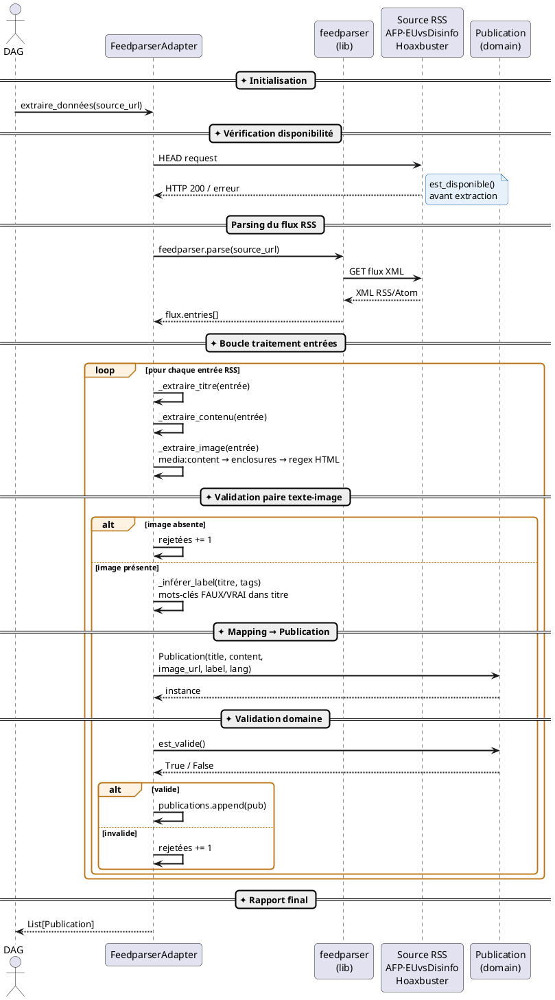
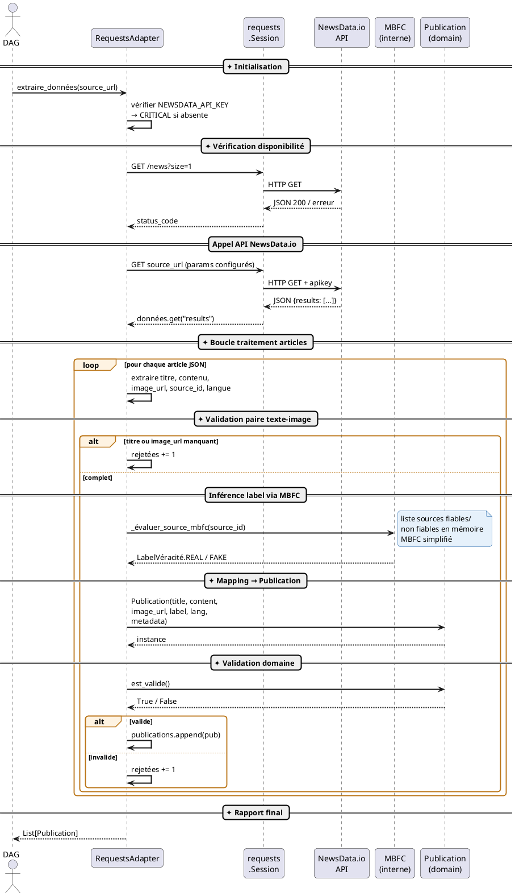
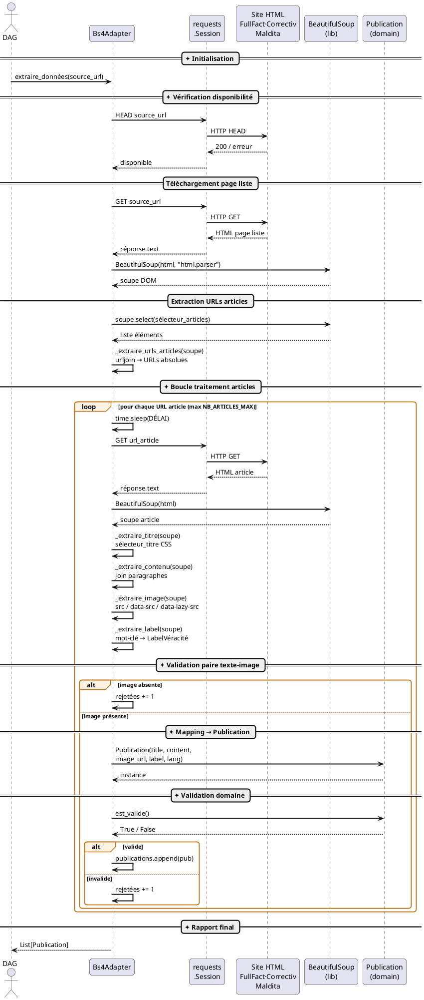
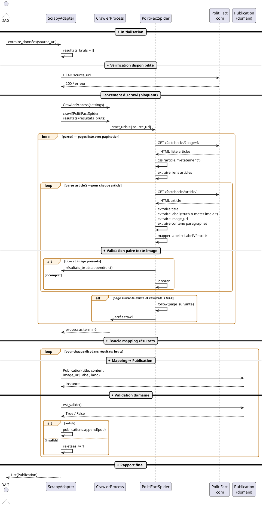
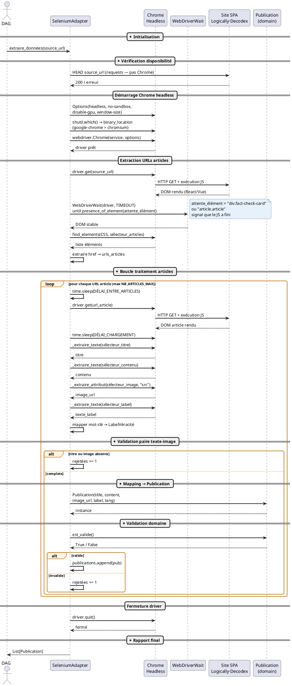
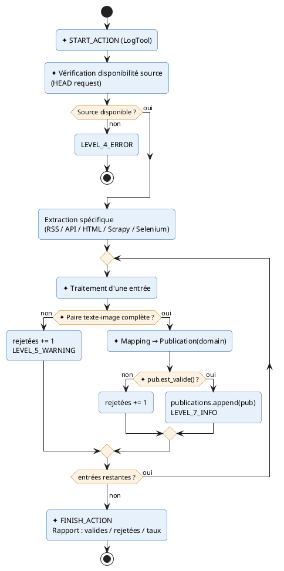

# CheckIt.AI — Diagrammes de Séquence des Adaptateurs
**Livrable L2** | Méthode `extraire_données()` | Juin 2026

Les étapes communes à tous les adaptateurs sont marquées ✦

---

## Étapes communes à tous les adaptateurs

```
✦ START_ACTION (LogTool)
✦ Vérification disponibilité source
✦ Boucle traitement entrées
✦ Validation paire texte-image
✦ Mapping → entité Publication
✦ pub.est_valide()
✦ Compteurs valides / rejetées
✦ FINISH_ACTION (LogTool) + rapport statistiques
```

---

## 1. FeedparserAdapter — Flux RSS



---

## 2. RequestsAdapter — API REST (NewsData.io + MBFC)



---

## 3. Bs4Adapter — HTML Statique (FullFact · Correctiv · Maldita)



---

## 4. ScrapyAdapter — Crawling Multi-pages (PolitiFact)



---

## 5. SeleniumAdapter — SPA JavaScript (Logically · Decodex)



---

## Résumé — Pipeline commun ✦


