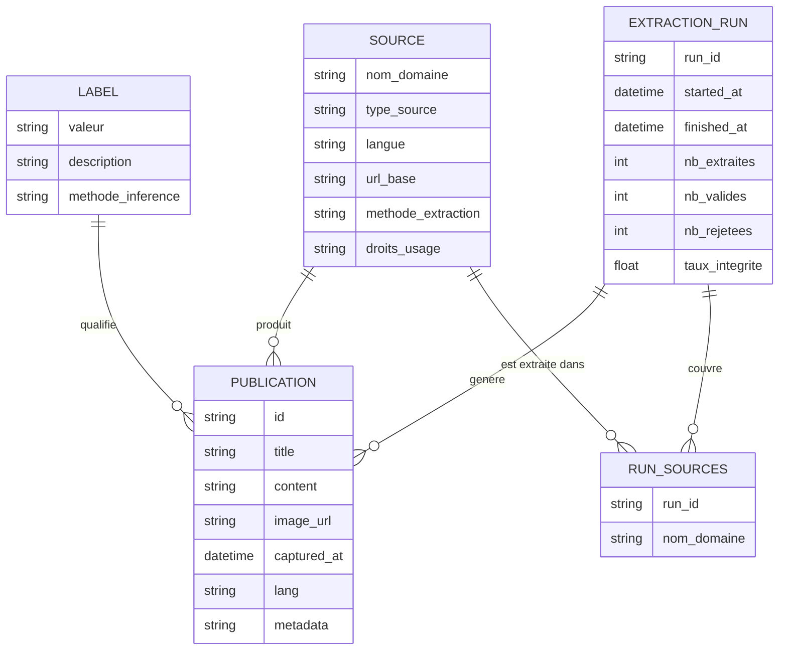
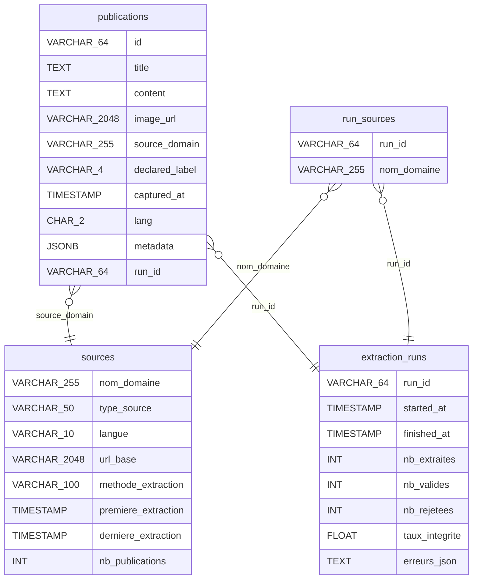
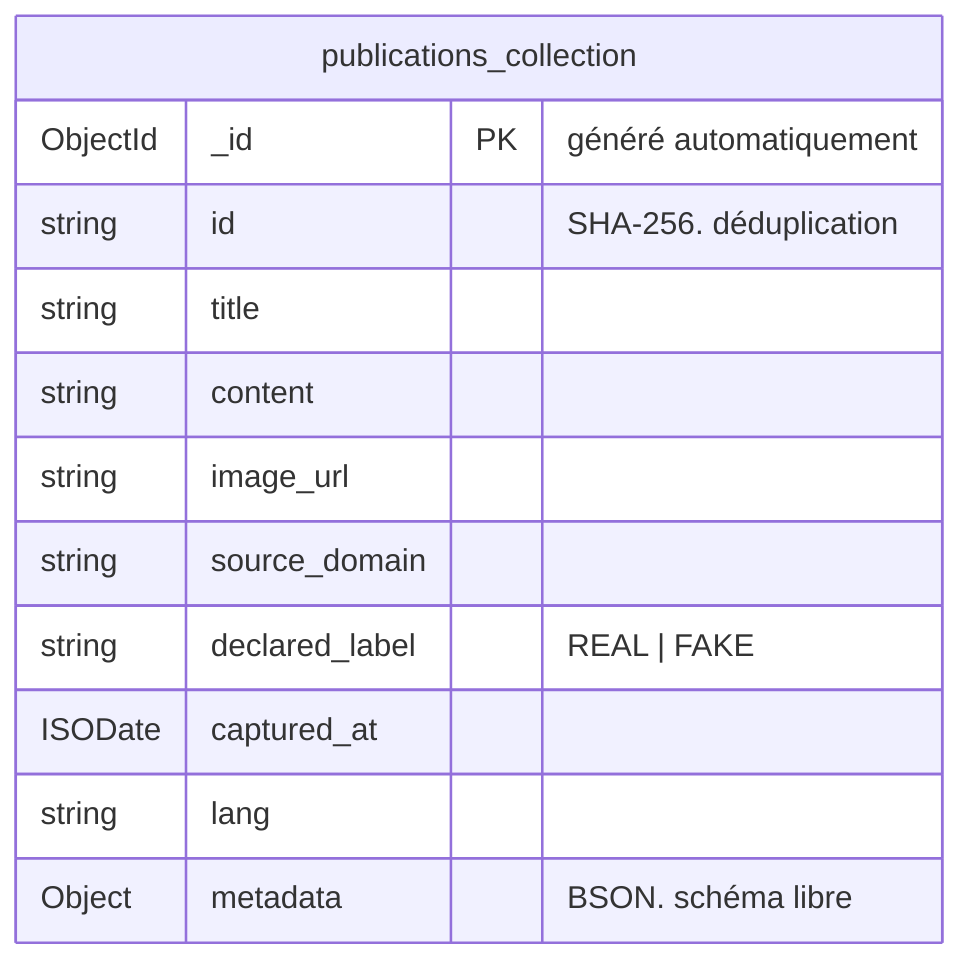
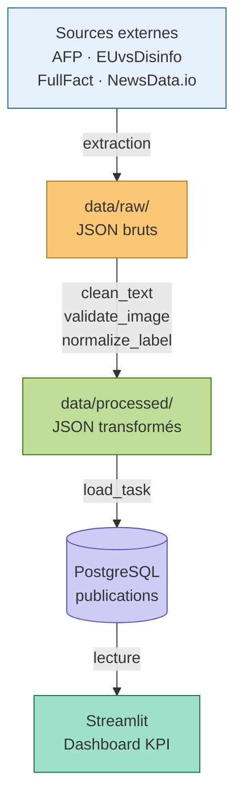

# CheckIt.AI.  Schéma de Données Finalisé
**Livrable L4** | Ingénieur Data Junior | Juin 2026

---

## 1. Modèle Conceptuel

Représentation métier indépendante de toute technologie.
Langage compréhensible par les parties prenantes non techniques.




### Cardinalités

| Relation | Type | Signification |
|----------|------|---------------|
| SOURCE → PUBLICATION | 1 à plusieurs | Une source produit N publications |
| LABEL → PUBLICATION | 1 à plusieurs | Un label qualifie N publications |
| EXTRACTION_RUN → PUBLICATION | 1 à plusieurs | Un run génère N publications |

---

## 2. Schéma Physique.  PostgreSQL (recommandé)

Structure SQL concrète avec types, index et contraintes d'intégrité.



### Définition SQL complète

```sql
-- ==============================================================
-- Table principale des publications
-- ==============================================================
CREATE TABLE publications (
    id              VARCHAR(64)             PRIMARY KEY,
    title           TEXT                    NOT NULL,
    content         TEXT,
    image_url       VARCHAR(2048)           NOT NULL,
    source_domain   VARCHAR(255)            NOT NULL,
    declared_label  VARCHAR(4)              NOT NULL
                    CHECK (declared_label IN ('REAL', 'FAKE')),
    captured_at     TIMESTAMP               DEFAULT NOW(),
    lang            CHAR(2)                 DEFAULT 'fr',
    metadata        JSONB,

    CONSTRAINT fk_source
        FOREIGN KEY (source_domain)
        REFERENCES sources (nom_domaine)
);

-- Index pour les requêtes fréquentes du dashboard
CREATE INDEX idx_label        ON publications (declared_label);
CREATE INDEX idx_source       ON publications (source_domain);
CREATE INDEX idx_captured_at  ON publications (captured_at DESC);
CREATE INDEX idx_lang         ON publications (lang);

-- ==============================================================
-- Table des sources d'extraction
-- ==============================================================
CREATE TABLE sources (
    nom_domaine         VARCHAR(255)    PRIMARY KEY,
    type_source         VARCHAR(50)     NOT NULL,
    langue              VARCHAR(10),
    url_base            VARCHAR(2048),
    méthode_extraction  VARCHAR(100),
    première_extraction TIMESTAMP,
    dernière_extraction TIMESTAMP,
    nb_publications     INTEGER         DEFAULT 0
);

-- ==============================================================
-- Table des runs d'extraction Airflow
-- ==============================================================
CREATE TABLE extraction_runs (
    run_id          VARCHAR(64)     PRIMARY KEY,
    started_at      TIMESTAMP       NOT NULL,
    finished_at     TIMESTAMP,
    nb_extraites    INTEGER         DEFAULT 0,
    nb_valides      INTEGER         DEFAULT 0,
    nb_rejetées     INTEGER         DEFAULT 0,
    taux_intégrité  FLOAT,
    erreurs_json    TEXT
);

-- Colonne de liaison publications → runs
ALTER TABLE publications
    ADD COLUMN run_id VARCHAR(64)
    REFERENCES extraction_runs (run_id);

-- ==============================================================
-- Tabla de liaison SOURCE ←→ EXTRACTION_RUN (N-N)
-- ==============================================================
CREATE TABLE run_sources (
    run_id      VARCHAR(64) REFERENCES extraction_runs(run_id),
    nom_domaine VARCHAR(255) REFERENCES sources(nom_domaine),
    PRIMARY KEY (run_id, nom_domaine)
);

```
---

## 3. Schéma MongoDB (alternatif)

Pour les cas où les métadonnées sont très variables entre sources.



```javascript
// Exemple de document MongoDB
{
  "_id"            : ObjectId("..."),
  "id"             : "a3f8c2d1e4b5...",
  "title"          : "FAUX : cette photo ne montre pas...",
  "content"        : "Une image circule sur les réseaux...",
  "image_url"      : "https://factuel.afp.com/image.jpg",
  "source_domain"  : "afp.com",
  "declared_label" : "FAKE",
  "captured_at"    : ISODate("2026-06-30T08:00:00Z"),
  "lang"           : "fr",
  "metadata"       : {
    "url_source"   : "https://factuel.afp.com/...",
    "auteur"       : "AFP Factuel",
    "date_publi"   : "2026-06-29",
    "catégories"   : ["politique", "immigration"],
    "score_mbfc"   : 0.95
  }
}

// Index MongoDB
db.publications.createIndex({ "declared_label": 1 })
db.publications.createIndex({ "source_domain": 1 })
db.publications.createIndex({ "captured_at": -1 })
db.publications.createIndex({ "id": 1 }, { unique: true })
```

---

## 4. Flux de Données.  Pipeline ETL



---

## 5. Choix PostgreSQL vs MongoDB

| Critère | PostgreSQL ✅ | MongoDB |
|---------|--------------|---------|
| Labels binaires REAL/FAKE | Idéal.  ENUM strict | Possible |
| Requêtes analytiques | SQL natif.  performant | Agrégations complexes |
| Jointures sources/runs | Nativement supporté | Lookup pipeline |
| Métadonnées variables | JSONB.  flexible | BSON natif |
| Intégrité référentielle | Contraintes FK | Pas de FK natif |
| **Recommandation** | **✅ Pour ce projet** | Alternatif si métadonnées très hétérogènes |

---

*CheckIt.AI.  Schéma de données L4.  Juin 2026*
